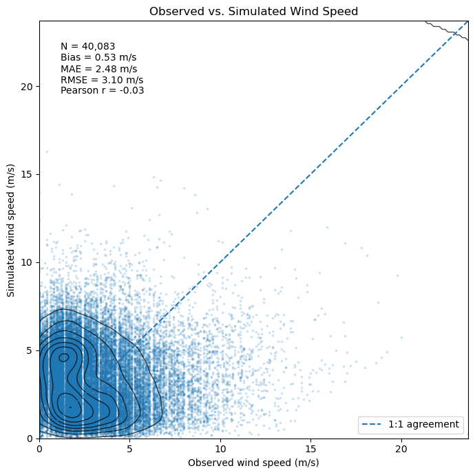
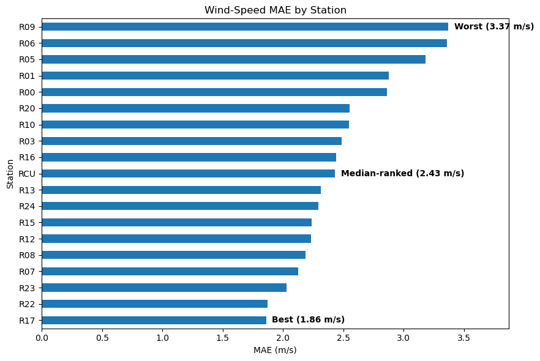
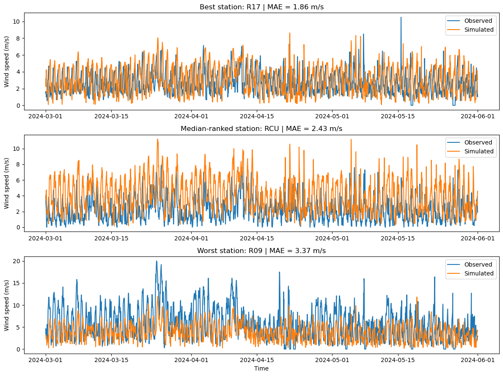

# Wind Model Validation

Validación de la confiabilidad de la velocidad y dirección del viento simuladas mediante su comparación con observaciones horarias en superficie. 

El proyecto desarrolla un flujo reproducible para extraer información meteorológica simulada en ubicaciones de estaciones de monitoreo, alinear ambas fuentes temporalmente y evaluar el desempeño mediante métricas estadísticas y gráficas.

## Resumen

La validación de simulaciones computacionales requiere comparar los resultados del modelo con observaciones independientes en superficie.

En este proyecto se analizan datos horarios de velocidad y dirección del viento correspondientes al periodo comprendido entre el 1 de marzo y el 31 de mayo de 2024.

## Flujo de trabajo

El flujo de trabajo consiste en la extracción de los datos simulados y su asociación con las ubicaciones de las estaciones de monitoreo, para la posterior extracción de las variables de viento correspondientes. Luego, la validación comprende la preparación de los datos, alineación estación-hora, cálculo de métricas estadísticas y análisis del comportamiento temporal y direccional. El análisis final considera 19 estaciones de monitoreo.


```text
Salidas del modelo atmosférico
            │
            ▼
01_extract_wrf_wind.py
            │
            ▼
Datos simulados por estación
            │
            ▼
Observaciones en superficie
            │
            ▼
02_wind_model_validation.ipynb
            │
            ├── Preparación y control de calidad
            ├── Alineación temporal
            ├── Validación de velocidad
            ├── Validación de dirección
            ├── Análisis por estación
            └── Análisis de sensibilidad
```

El script de extracción genera (a partir de los outputs de la simulación) una serie temporal de velocidad y dirección del viento asociada con la ubicación de cada estación. Posteriormente, el notebook de validación combina estos datos con las observaciones mediante `station` y `timestamp`.

## Datos

El análisis utiliza dos fuentes de datos:

- Observaciones en superficie: archivos independientes correspondientes a cada estación de monitoreo, con mediciones horarias de velocidad y dirección del viento, además de otras variables.
- Datos simulados: archivo generado durante la etapa de extracción, que contiene las variables simuladas para todas las estaciones.

La estructura de los datos utilizados durante la validación es:

| Variable | Descripción |
|---|---|
| `station` | Identificador de cada estación |
| `timestamp` | Fecha y hora del registro |
| `wind_obs` | Velocidad del viento observada (m/s) |
| `dir_obs` | Dirección del viento observada (°) |
| `wind_sim` | Velocidad del viento simulada (m/s) |
| `dir_sim` | Dirección del viento simulada (°) |

En el directorio `data/` se encuentran archivos que muestran la estructura general de los datos para ambos conjuntos.

## Cobertura de la validación

La simulación contiene una resolución temporal horaria continua para el periodo analizado, mientras que las observaciones presentan cierta cantidad de registros faltantes en algunas estaciones. Después de realizar la alineación temporal entre observaciones y simulaciones se obtiene el siguiente número de registros.

| Indicador | Resultado |
|---|---:|
| Estaciones evaluadas | 19 |
| Horas esperadas por estación | 2,208 |
| Horas-estación esperadas | 41,952 |
| Registros estación-hora emparejados | 40,083 |
| Cobertura de validación | 95.5% |

## Metodología de validación

### Velocidad del viento

La comparación de velocidad del viento utiliza las siguientes métricas de error:

- Bias: identifica tendencias de sobreestimación o subestimación.
- MAE: cuantifica la magnitud promedio del error absoluto.
- RMSE: similar al MAE, pero penaliza más los errores grandes.
- Pearson r: evalúa la asociación lineal entre la variabilidad temporal observada y simulada.

Bias, MAE y RMSE cuantifican diferencias entre los valores observados y simulados, mientras que Pearson \(r\) aporta información sobre su covariación. Debido a la naturaleza temporal de los datos, las observaciones consecutivas pueden presentar autocorrelación, por lo que \(r\) se utiliza únicamente como una medida descriptiva complementaria y no como una medida directa de acuerdo o independencia estadística. Estas métricas se interpretan de manera conjunta, ya que una correlación elevada no implica necesariamente un error bajo.

### Dirección del viento

Debido a que la dirección es una variable perioda, el error no se calcula mediante una resta convencional, en cambio, se utiliza la diferencia angular mínima:

$\[e_{\theta}=((\theta_{sim}-\theta_{obs}+180)\bmod360)-180\]$

De esta forma, los errores permanecen dentro del intervalo:

$\[-180^\circ,180^\circ]\$

A partir de esta diferencia se calculan Bias, MAE y RMSE angulares.

## Resultados principales

### Velocidad del viento

Para el conjunto completo de observaciones emparejadas se obtuvieron:

| Métrica | Resultado |
|---|---:|
| N | 40,083 |
| Bias | 0.53 m/s |
| MAE | 2.48 m/s |
| RMSE | 3.10 m/s |
| Pearson r | -0.03 |

El bias positivo indica una ligera tendencia global de la simulación a sobreestimar la velocidad del viento. El MAE y el RMSE muestran un error de 2.48 m/s y 3.10 m/s, respectivamente; mientras que el valor de r nos indica una capacidad limitada de la simulación para reproducir la variabilidad de los datos.





### Variabilidad entre estaciones

El desempeño no es uniforme entre las estaciones de monitoreo.

El MAE por estación varió entre 1.86 m/s en la estación con menor error y 3.37 m/s en la estación con mayor error.




### Comportamiento temporal

Para visualizar diferencias en el comportamiento temporal se seleccionaron tres estaciones representativas a partir del ranking de MAE. La comparación permite observar que un MAE relativamente bajo no implica necesariamente una reproducción adecuada de todas las fluctuaciones horarias.




### Dirección del viento

La validación direccional muestra discrepancias considerablemente mayores que las observadas para la magnitud de la velocidad.

La distribución del error angular permite identificar tanto la magnitud como el sentido de las diferencias entre las direcciones observadas y simuladas.


## Análisis de sensibilidad

La dirección del viento puede presentar una mayor variabilidad bajo condiciones cercanas a calma (vientos con poca velocidad).

Para evaluar este efecto, las métricas direccionales se recalcularon utilizando únicamente observaciones con $$V_{obs}>2\text{ m/s}\$$.

Los resultados fueron:

| Condición | MAE angular | RMSE angular |
|---|---:|---:|
| Todas las observaciones | 83.15° | 98.80° |
| Velovidad observada > 2 m/s | 76.24° | 93.03° |

El filtro conserva aproximadamente 53% de los registros originales.

La disminución del error indica que las condiciones de viento débil contribuyen a la incertidumbre direccional. Sin embargo, las discrepancias continúan siendo importantes después de aplicar la restricción.


## Principales conclusiones

Los resultados muestran que la evaluación del modelo depende de la métrica utilizada y de la estación considerada. La velocidad del viento presenta errores de magnitud moderada, con un MAE global de 2.48 m/s, aunque la correlación temporal global es débil. Asimismo, existen diferencias importantes entre estaciones, con MAE individuales entre  1.86 y 3.37 m/s.

La dirección del viento representa el principal desafío de la validación. La exclusión de condiciones de viento débil reduce parcialmente los errores angulares, pero no elimina las discrepancias existentes.


## Estructura del repositorio

```text
wind-model-validation/
│
├── README.md
├── requirements.txt
├── .gitignore
│
├── scripts/
│   └── 01_extract_wrf_wind.py
│
├── notebooks/
│   └── 02_wind_model_validation.ipynb
│
├── data/
│   └── sample/
│       ├── ramm_sample.csv
│       └── sim_sample.csv
│
└── figures/
    ├── obs_vs_sim.png
    ├── dist_wd.png
    ├── error_Ws.png
    ├── sens_wd.png
    └── serie_temp.png
```


